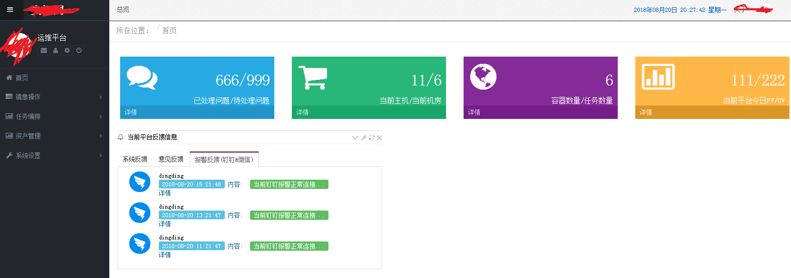
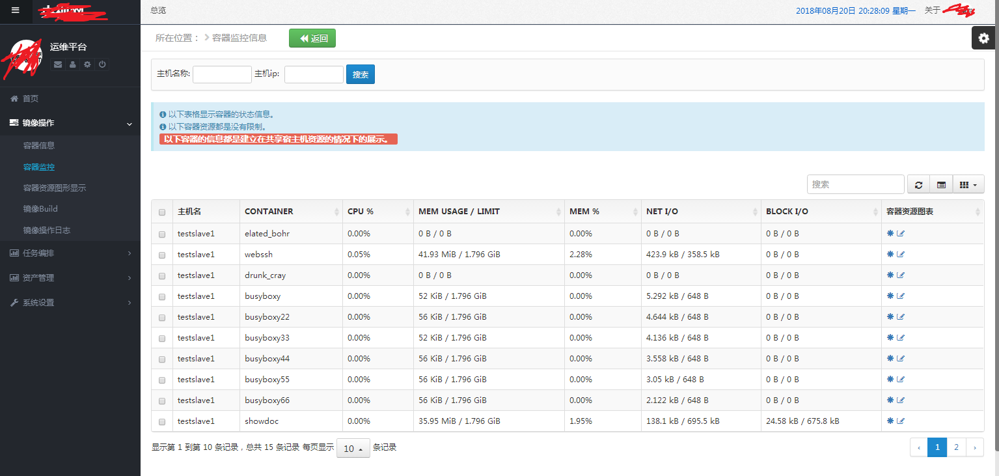
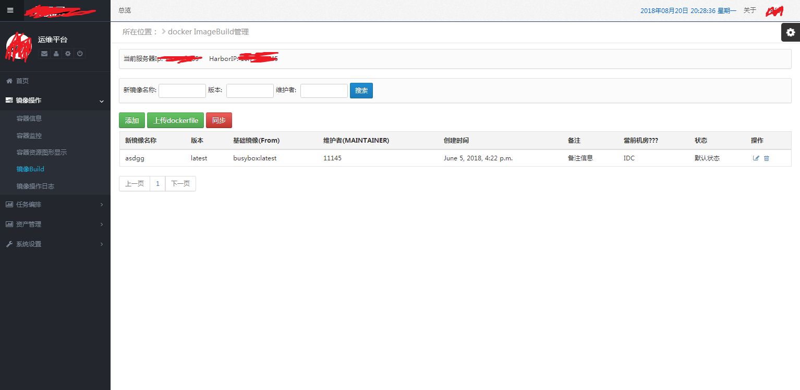
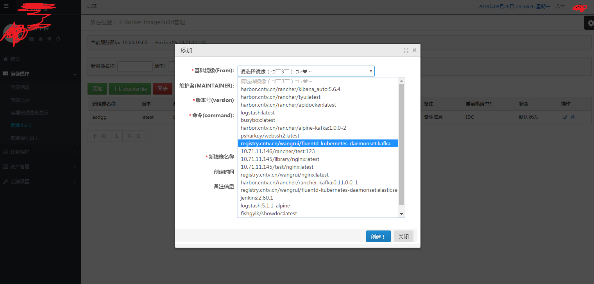
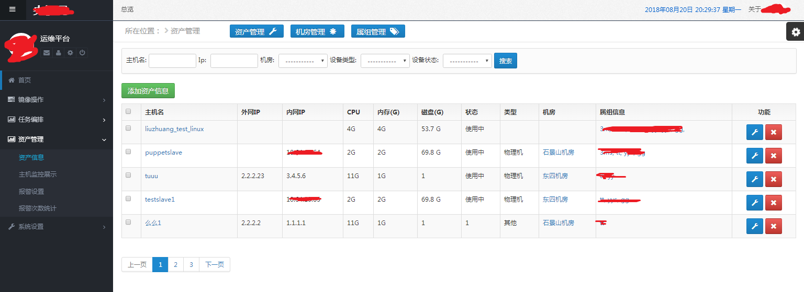
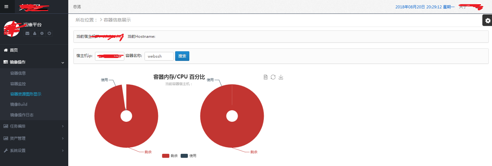
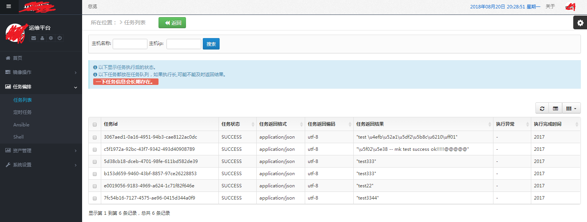
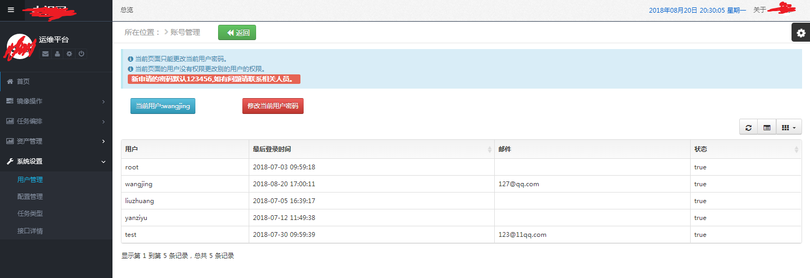

# Crazygirl

#### 项目介绍
这是一个监控容器和宿主机的平台，使用钉钉和微信报警，对接ELK, 私有仓库需要自己搭建，类似Rancher平台对于容器的操作
容器的镜像，自动打包，上传私有镜像，dockerfile的管理，容器可视化监控，celery 异步操作，任务编排，资产管理等

#### 软件架构
软件架构说明

#### 内容

##### 首页：
	首页显示agent收集上来的问题，以及待处理的问题
    显示机房数量以及主机数量
    容器数量以及人物数量
    当前平台当前的点击量
    因为使用钉钉报警和微信报警，把报警信息显示在下面的切换卡上，及时查看，以及显示当前服务器的负载信息，和平台的反馈改进信息

##### 容器操作：
    此平台在于在于对于容器的管理，当然也包含宿主机的操作
	因为内网已经搭建harbor私有仓库，所以此平台都是调用的harbor仓库的镜像，不必为镜像获取而进行复杂操作

##### 镜像打包：
	此平台对于镜像进行上传dockerfile和自动获取基础镜像进行打包，两种方式，自动获取当前平台所在服务器上的所有images作为打包的基础镜像（FROM base_image）

##### 宿主机的资产信息
	通过agent，进行推送信息给server端信息
	收集包括（负载，内存，磁盘，挂载，网络，网速，容器信息，后端信息，定时，主要的进程数量）等
 

#### charts 图表
	通过echarts 显示服务器和容器的当前状态

#### 任务
	通过celery 进行异步处理信息，结合bootstrap table，可以处理大量的请求，对于celery自带的定时，做成图表的形式进行操作

#### 配置
	通过配置选项，可以对数据库，端口，配置文件，日志路径，ip,端口，数据库账号密码进行更改

#### 安装教程

1. 在Crazygirl\Crazygirl\common 目录下，有agent，但是需要根据requests.txt 的内容安装所需要的package
2. 后台运行agent,需要修改server ip，替换成你的server安装的ip
3. server 端需要当前没有配置wsgi，直接使用django本身的命令启动

